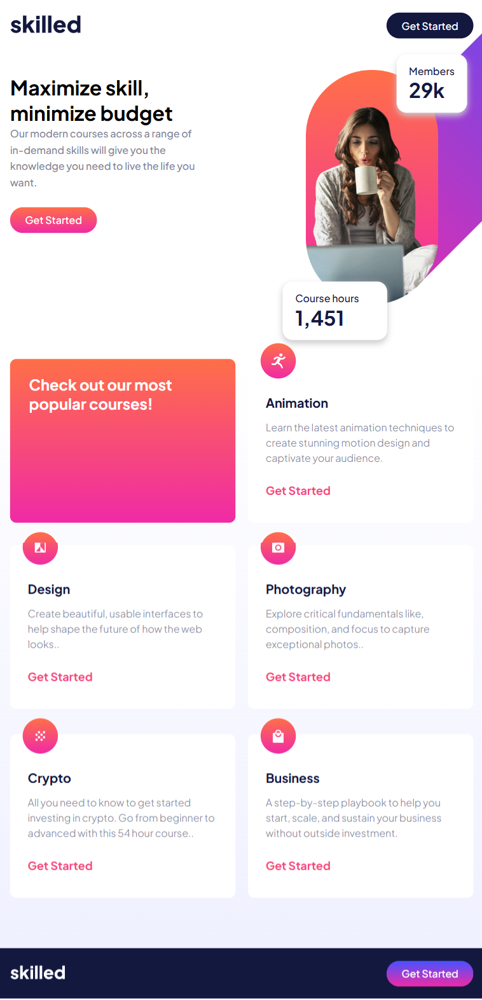
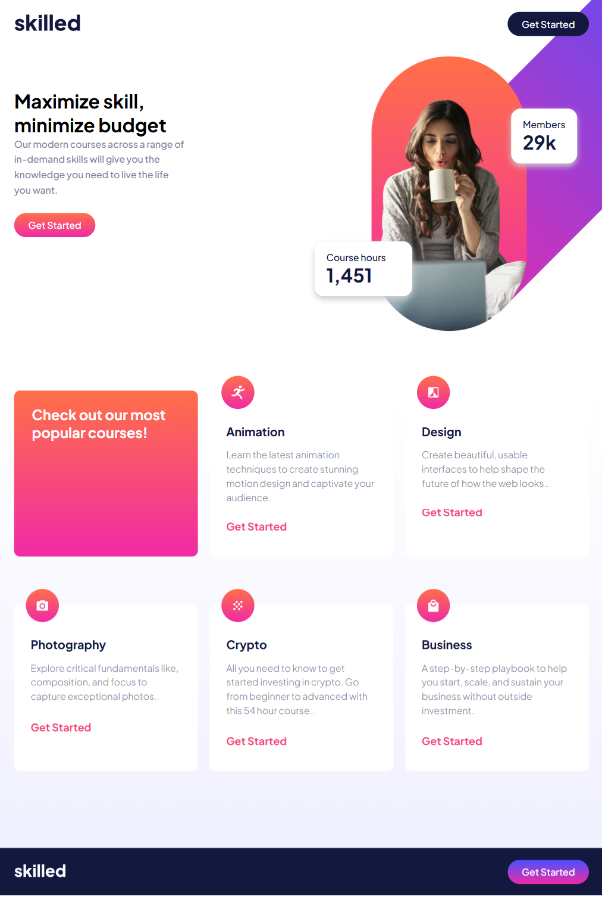
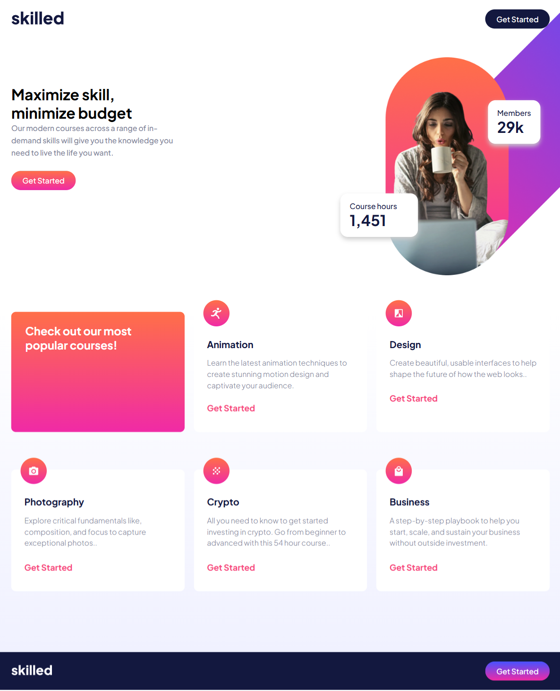
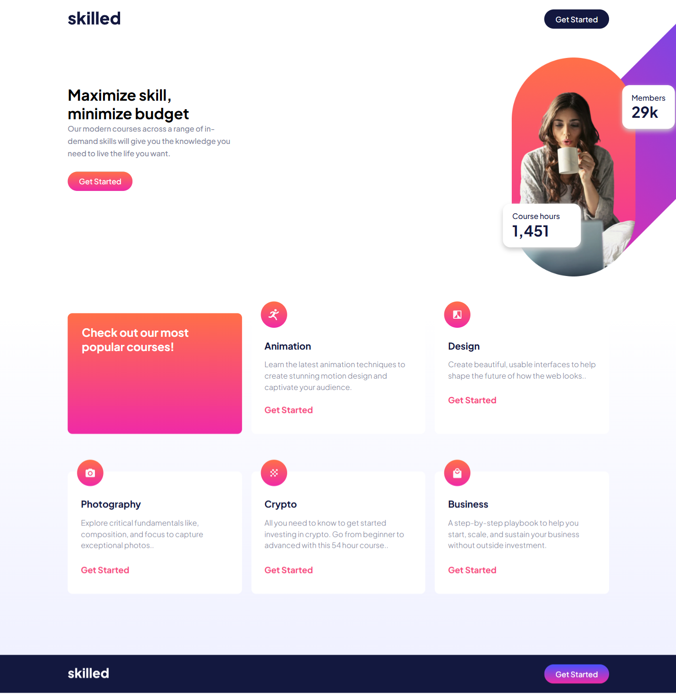

# Header Responsive para Página Web

Este proyecto consiste en un header responsive diseñado para adaptarse a diferentes tamaños de pantalla. Utiliza HTML y CSS/SASS para implementar un diseño moderno y atractivo.

## Para teléfonos móviles


## Para tablets(768px)


## Para tablets horizontales(1024px)


## Para pantallas de escritorio(1200px)


## Para pantallas de escritorio XL (1400px)


## Tecnologías Usadas

- HTML
- CSS
- SASS

## Instalación

1. Clona este repositorio o descarga los archivos.
2. Asegúrate de tener npm instalados en tu sistema.
3. Instala las dependencias de SASS ejecutando el siguiente comando en la terminal:

   ```bash
   npm install sass --save-dev
   ```
   
## Compila los archivos SASS ejecutando:

npx sass src/styles/main.scss src/styles/main.css

## Uso
Abre el archivo index.html en tu navegador para ver el header en acción.
Para hacer cambios en los estilos, edita el archivo main.scss y recompila usando el comando mencionado anteriormente.

## Responsive Design
El header es completamente responsive y se adapta a dispositivos móviles y de escritorio. Al visualizar en pantallas pequeñas o grandes, los estilos del menú de navegación se ajustan para mantener la usabilidad y la estética.

- **Media Queries:** Se han implementado media queries para optimizar la presentación en dispositivos específicos, como:

  - Tablets (768px)
  - Tablets horizontales (1024px)
  - Pantallas de escritorio (1200px)
  - Desktops XL (1440px)

## Contribuir
Las contribuciones son bienvenidas. Si tienes alguna sugerencia o mejora, no dudes en crear un pull request.

## Licencia
Este proyecto está licenciado bajo la Licencia MIT. Consulta el archivo [LICENSE](LICENSE) para más detalles.

## Autor

- **Rosmén Valencia** - [PerfilGitHub](https://github.com/RosmenPro)
